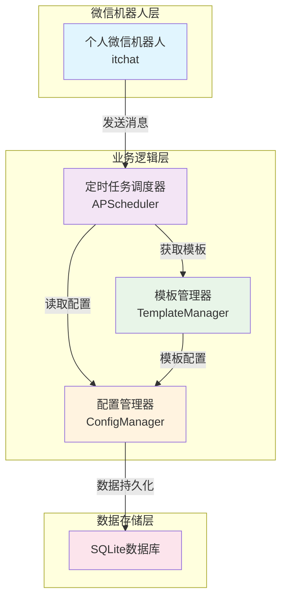

# 微信接龙机器人技术文档

## 项目概述

本项目旨在开发一个微信机器人，用于在微信群聊中根据模板定时发送接龙消息，主要用于羽毛球活动报名。机器人支持多群组管理，不同群组使用不同的消息模板，每周定时发送，且机器人自身不参与报名。

## 技术架构

### 系统架构



### 技术栈选择

#### 核心框架
- **微信机器人框架**: itchat (Python)
- **定时任务调度**: APScheduler
- **模板引擎**: 简单字符串替换
- **数据存储**: SQLite
- **开发语言**: Python 3.8+

#### 技术栈优势
- **itchat**: 成熟的微信个人号API，支持消息收发，部署简单
- **APScheduler**: 强大的Python定时任务库，支持cron表达式
- **SQLite**: 轻量级数据库，无需额外服务，适合小型应用
- **Python**: 开发效率高，生态丰富，易于维护

## 核心模块详细设计

### 1. 个人微信机器人核心模块 (PersonalWeChatBot)

**功能职责：**
- 微信登录和会话管理
- 群聊消息发送
- 异常处理和重连机制

**核心实现：**
```python
import itchat
import logging

class PersonalWeChatBot:
    """个人微信机器人"""

    def __init__(self):
        self.logger = logging.getLogger(__name__)
        self.is_logged_in = False

    def login(self) -> bool:
        """登录微信"""
        try:
            self.logger.info("正在登录微信...")
            itchat.auto_login(hotReload=True, enableCmdQR=2)
            self.is_logged_in = True
            self.logger.info("微信登录成功")
            return True
        except Exception as e:
            self.logger.error(f"微信登录失败: {e}")
            return False

    def send_message_to_group(self, group_name: str, message: str) -> bool:
        """发送消息到微信群"""
        if not self.is_logged_in:
            self.logger.error("请先登录微信")
            return False

        try:
            # 搜索群聊
            groups = itchat.search_chatrooms(name=group_name)
            if not groups:
                self.logger.error(f"未找到群聊: {group_name}")
                return False

            # 获取第一个匹配的群聊
            group = groups[0]

            # 发送消息
            itchat.send_msg(message, group['UserName'])
            self.logger.info(f"已发送消息到群聊: {group_name}")
            return True

        except Exception as e:
            self.logger.error(f"发送消息失败: {e}")
            return False
```

### 2. 定时任务调度模块 (TaskScheduler)

**功能职责：**
- 管理每周定时任务
- 动态添加/删除群组任务
- 任务状态监控和日志记录
- 异常任务重试机制

**核心实现：**
```python
from apscheduler.schedulers.background import BackgroundScheduler
from apscheduler.triggers.cron import CronTrigger
from apscheduler.events import EVENT_JOB_EXECUTED, EVENT_JOB_ERROR
import pytz
import logging

class TaskScheduler:
    """定时任务调度器"""

    def __init__(self, bot, template_manager):
        self.scheduler = BackgroundScheduler()
        self.bot = bot
        self.template_manager = template_manager
        self.timezone = pytz.timezone('Asia/Shanghai')
        self.logger = logging.getLogger(__name__)

        # 设置事件监听
        self.scheduler.add_listener(self._job_executed, EVENT_JOB_EXECUTED)
        self.scheduler.add_listener(self._job_error, EVENT_JOB_ERROR)

    def add_weekly_task(self, group_name, template_name, day_of_week, hour, minute):
        """添加每周定时任务"""
        try:
            trigger = CronTrigger(
                day_of_week=day_of_week,  # 0-6 或 mon-sun
                hour=hour,
                minute=minute,
                timezone=self.timezone
            )

            self.scheduler.add_job(
                self._send_signup_message,
                trigger,
                args=[group_name, template_name],
                id=f"{group_name}_weekly",
                replace_existing=True
            )

            self.logger.info(f"已添加定时任务: {group_name} - {day_of_week} {hour}:{minute}")
            return True

        except Exception as e:
            self.logger.error(f"添加定时任务失败: {e}")
            return False

    def _send_signup_message(self, group_name, template_name):
        """发送接龙消息"""
        try:
            message = self.template_manager.render_template(template_name)
            success = self.bot.send_message_to_group(group_name, message)

            if success:
                self.logger.info(f"成功发送接龙消息到: {group_name}")
            else:
                self.logger.error(f"发送接龙消息失败: {group_name}")

        except Exception as e:
            self.logger.error(f"发送接龙消息异常: {e}")
```

### 3. 模板管理模块 (TemplateManager)

**功能职责：**
- 模板存储和编辑
- 变量替换和模板渲染
- 多群组模板配置管理

**核心实现：**
```python
import json
import os
from datetime import datetime
import logging

class TemplateManager:
    """模板管理器"""

    def __init__(self, config_file='config/templates.json'):
        self.config_file = config_file
        self.logger = logging.getLogger(__name__)
        self.templates = self._load_templates()

    def _load_templates(self):
        """加载模板配置"""
        try:
            # 确保配置目录存在
            os.makedirs(os.path.dirname(self.config_file), exist_ok=True)

            if os.path.exists(self.config_file):
                with open(self.config_file, 'r', encoding='utf-8') as f:
                    return json.load(f)
            else:
                # 创建默认模板配置
                default_templates = {
                    "default": {
                        "content": "【羽毛球活动报名】\n时间：{{date}} {{weekday}} {{time}}\n地点：{{location}}\n费用：{{price}}\n\n报名接龙：\n1. \n2. \n3. ",
                        "variables": {
                            "time": "19:00-21:00",
                            "location": "XX羽毛球馆",
                            "price": "30元/人"
                        }
                    }
                }
                self._save_templates(default_templates)
                return default_templates

        except Exception as e:
            self.logger.error(f"加载模板配置失败: {e}")
            return {}

    def render_template(self, template_name, extra_variables=None):
        """渲染模板"""
        try:
            template_config = self.templates.get(template_name)
            if not template_config:
                self.logger.error(f"模板不存在: {template_name}")
                return ""

            template = template_config["content"]
            variables = template_config.get("variables", {})

            # 合并变量
            if extra_variables:
                variables.update(extra_variables)

            # 添加系统变量
            system_vars = {
                'date': datetime.now().strftime('%Y-%m-%d'),
                'weekday': ['周一', '周二', '周三', '周四', '周五', '周六', '周日'][datetime.now().weekday()],
                'timestamp': datetime.now().strftime('%H:%M:%S')
            }
            variables.update(system_vars)

            # 模板渲染
            rendered = template
            for key, value in variables.items():
                placeholder = f"{{{{{key}}}}}"
                rendered = rendered.replace(placeholder, str(value))

            return rendered

        except Exception as e:
            self.logger.error(f"模板渲染失败: {e}")
            return ""
```

### 4. 配置管理模块 (ConfigManager)

**功能职责：**
- 群组配置管理
- 定时任务配置存储
- 系统设置管理
- 数据持久化

**核心实现：**
```python
import sqlite3
import json
import logging
from typing import Dict, List, Optional

class ConfigManager:
    """配置管理器 - 支持个人微信机器人"""

    def __init__(self, db_file='data/wechat_bot.db'):
        self.db_file = db_file
        self.logger = logging.getLogger(__name__)
        self._init_database()

    def _init_database(self):
        """初始化数据库"""
        try:
            # 确保数据目录存在
            import os
            os.makedirs(os.path.dirname(self.db_file), exist_ok=True)

            conn = sqlite3.connect(self.db_file)
            cursor = conn.cursor()

            # 创建群组配置表
            cursor.execute('''
                CREATE TABLE IF NOT EXISTS group_configs (
                    id INTEGER PRIMARY KEY AUTOINCREMENT,
                    group_name TEXT UNIQUE NOT NULL,
                    template_name TEXT NOT NULL,
                    schedule_day INTEGER NOT NULL,  -- 0-6 代表周一到周日
                    schedule_time TEXT NOT NULL,    -- HH:MM 格式
                    is_active BOOLEAN DEFAULT 1,
                    created_time TIMESTAMP DEFAULT CURRENT_TIMESTAMP,
                    updated_time TIMESTAMP DEFAULT CURRENT_TIMESTAMP
                )
            ''')

            # 创建发送记录表
            cursor.execute('''
                CREATE TABLE IF NOT EXISTS send_records (
                    id INTEGER PRIMARY KEY AUTOINCREMENT,
                    group_name TEXT NOT NULL,
                    message_content TEXT,
                    send_time TIMESTAMP DEFAULT CURRENT_TIMESTAMP,
                    success BOOLEAN DEFAULT 1
                )
            ''')

            conn.commit()
            conn.close()
            self.logger.info("数据库初始化完成")

        except Exception as e:
            self.logger.error(f"数据库初始化失败: {e}")
            raise

    def add_group_config(self, group_name: str, template_name: str,
                        schedule_day: int, schedule_time: str) -> bool:
        """添加群组配置"""
        try:
            conn = sqlite3.connect(self.db_file)
            cursor = conn.cursor()

            cursor.execute('''
                INSERT OR REPLACE INTO group_configs
                (group_name, template_name, schedule_day, schedule_time, is_active)
                VALUES (?, ?, ?, ?, 1)
            ''', (group_name, template_name, schedule_day, schedule_time))

            conn.commit()
            conn.close()
            self.logger.info(f"已添加群组配置: {group_name}")
            return True

        except Exception as e:
            self.logger.error(f"添加群组配置失败: {e}")
            return False
```

### 5. 主程序集成 (SignupBot)

**功能职责：**
- 模块集成和协调
- 程序启动和关闭
- 异常处理和恢复
- 日志配置和管理

**核心实现：**
```python
import logging
import signal
import sys
from .core.personal_bot import PersonalWeChatBot
from .core.scheduler import TaskScheduler
from .managers.template_manager import TemplateManager
from .managers.config_manager import ConfigManager

class SignupBot:
    """微信接龙机器人主类"""

    def __init__(self):
        self.setup_logging()
        self.logger = logging.getLogger(__name__)

        # 初始化各个模块
        self.bot = PersonalWeChatBot()
        self.template_manager = TemplateManager()
        self.config_manager = ConfigManager()
        self.schedulers = []

        # 设置信号处理
        signal.signal(signal.SIGINT, self._signal_handler)
        signal.signal(signal.SIGTERM, self._signal_handler)

    def start(self):
        """启动机器人"""
        try:
            self.logger.info("开始启动微信接龙机器人...")

            # 登录个人微信
            if not self._login_wechat():
                self.logger.error("微信登录失败，程序退出")
                return

            # 从数据库加载配置并设置定时任务
            self._load_scheduled_tasks()

            self.logger.info("微信接龙机器人启动成功")
            self.logger.info("程序将在后台运行，按 Ctrl+C 退出")

            # 保持程序运行
            import time
            while True:
                time.sleep(60)

        except Exception as e:
            self.logger.error(f"启动失败: {e}")
            self.shutdown()
```

## 使用指南

### 快速开始

1. **安装依赖**
   ```bash
   uv sync
   ```

2. **配置群组**
   ```bash
   uv run python scripts/config_cli.py add-group "羽毛球群" default 4 "20:00"
   ```

3. **启动机器人**
   ```bash
   uv run python scripts/run_bot.py
   ```

### 配置管理

#### 添加群组配置
```bash
uv run python scripts/config_cli.py add-group <群组名称> <模板名称> <星期几> <发送时间>
```

示例：
```bash
uv run python scripts/config_cli.py add-group "羽毛球群" default 4 "20:00"
```

#### 查看群组配置
```bash
uv run python scripts/config_cli.py list-groups
```

#### 添加模板
```bash
uv run python scripts/config_cli.py add-template <模板名称>
```

#### 查看模板
```bash
uv run python scripts/config_cli.py list-templates
```

### 项目结构

```
wechat-dev/
├── src/wechat_bot/          # 主包目录
│   ├── core/                # 核心模块
│   │   ├── personal_bot.py         # 个人微信机器人核心
│   │   └── scheduler.py     # 定时任务调度器
│   ├── managers/            # 管理器模块
│   │   ├── config_manager.py     # 配置管理器
│   │   └── template_manager.py   # 模板管理器
│   ├── cli/                 # 命令行接口
│   │   └── commands.py      # CLI 配置管理命令
│   ├── __init__.py          # 包初始化
│   └── main.py              # 主程序入口
├── scripts/                 # 可执行脚本
│   ├── run_bot.py          # 启动机器人脚本
│   └── config_cli.py       # 配置管理脚本
├── tests/                   # 测试目录
│   └── test_bot.py         # 系统测试
├── config/                  # 配置文件
├── data/                    # 数据文件
├── logs/                    # 日志文件
└── docs/                    # 文档
```

## 注意事项

### 个人微信版本特点
- **优点**：直接在微信群聊中发送消息，用户体验好
- **缺点**：存在封号风险，需要扫码登录，稳定性较差
- **适用场景**：小范围测试、内部使用、非商业用途

### 使用建议
1. **小范围使用**：建议在内部群组或小范围使用，避免频繁发送消息
2. **定期检查**：定期检查机器人运行状态和微信登录状态
3. **备份配置**：定期备份数据库和模板配置
4. **测试环境**：先在测试群组中验证功能，再应用到正式群组

### 常见问题

1. **微信登录失败**
   - 检查网络连接
   - 确认微信账号正常
   - 尝试重新扫码登录

2. **消息发送失败**
   - 确认群组名称正确
   - 检查机器人是否在群聊中
   - 确认微信登录状态

3. **定时任务不执行**
   - 检查系统时间设置
   - 确认调度器是否正常启动
   - 检查日志文件中的错误信息

## 扩展功能

### 模板变量支持
系统支持以下模板变量：
- `{{date}}`：当前日期 (YYYY-MM-DD)
- `{{weekday}}`：当前星期 (周一至周日)
- `{{time}}`：活动时间
- `{{location}}`：活动地点
- `{{price}}`：活动费用
- `{{note}}`：备注信息

### 自定义模板
可以通过CLI命令添加自定义模板，支持灵活的变量配置。

## 版本历史

- **v1.0**：初始版本，基于个人微信的接龙机器人
- **简化架构**：移除公众号支持，专注个人微信版本

---

**开始使用您的微信接龙机器人！**