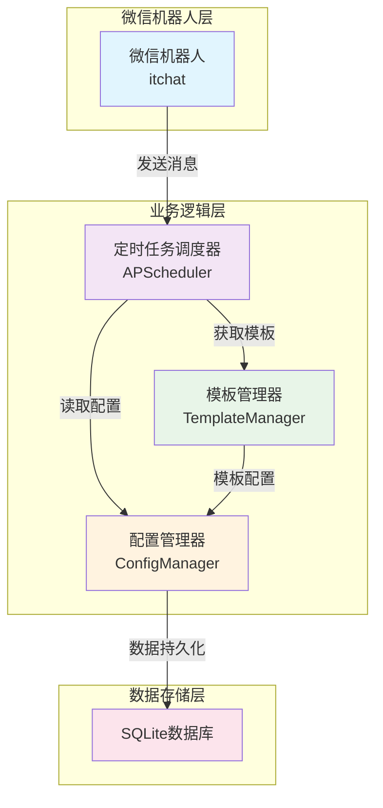

# 微信接龙机器人技术方案

## 项目概述

本项目旨在开发一个微信机器人，用于在微信群聊中根据模板定时发送接龙消息，主要用于羽毛球活动报名。机器人支持多群组管理，不同群组使用不同的消息模板，每周定时发送，且机器人自身不参与报名。

## 技术栈选择

### 核心框架
- **微信机器人框架**: itchat (Python)
- **定时任务调度**: APScheduler
- **模板引擎**: Jinja2 (或简单字符串替换)
- **数据存储**: SQLite
- **开发语言**: Python 3.8+

### 技术栈优势
- **itchat**: 成熟的微信个人号API，支持消息收发，部署简单
- **APScheduler**: 强大的Python定时任务库，支持cron表达式
- **SQLite**: 轻量级数据库，无需额外服务，适合小型应用
- **Python**: 开发效率高，生态丰富，易于维护

## 系统架构



## 核心模块详细设计

### 1. 微信机器人核心模块 (WechatBot)

**功能职责：**
- 微信登录和会话管理
- 群聊消息监听和发送
- 自动回复处理
- 异常处理和重连机制

**核心实现：**
```python
import itchat
from itchat.content import TEXT
import logging

class WechatBot:
    def __init__(self):
        self.logger = logging.getLogger(__name__)
        self.scheduler = None
        
    def login(self):
        """微信登录"""
        try:
            itchat.auto_login(
                hotReload=True,
                enableCmdQR=2,
                statusStorageDir='itchat.pkl'
            )
            self.logger.info("微信登录成功")
        except Exception as e:
            self.logger.error(f"微信登录失败: {e}")
            raise
            
    def send_group_message(self, group_name, message):
        """发送群消息"""
        try:
            groups = itchat.search_chatrooms(name=group_name)
            if groups:
                groups[0].send(message)
                self.logger.info(f"成功发送消息到群组: {group_name}")
                return True
            else:
                self.logger.warning(f"未找到群组: {group_name}")
                return False
        except Exception as e:
            self.logger.error(f"发送消息失败: {e}")
            return False
            
    def start_listening(self):
        """启动消息监听"""
        try:
            itchat.run()
        except KeyboardInterrupt:
            self.logger.info("程序被用户中断")
        except Exception as e:
            self.logger.error(f"消息监听异常: {e}")
```

### 2. 定时任务调度模块 (TaskScheduler)

**功能职责：**
- 管理每周定时任务
- 动态添加/删除群组任务
- 任务状态监控和日志记录
- 异常任务重试机制

**核心实现：**
```python
from apscheduler.schedulers.background import BackgroundScheduler
from apscheduler.triggers.cron import CronTrigger
from apscheduler.events import EVENT_JOB_EXECUTED, EVENT_JOB_ERROR
import pytz
import logging

class TaskScheduler:
    def __init__(self, bot, template_manager):
        self.scheduler = BackgroundScheduler()
        self.bot = bot
        self.template_manager = template_manager
        self.timezone = pytz.timezone('Asia/Shanghai')
        self.logger = logging.getLogger(__name__)
        
        # 设置事件监听
        self.scheduler.add_listener(self._job_executed, EVENT_JOB_EXECUTED)
        self.scheduler.add_listener(self._job_error, EVENT_JOB_ERROR)
        
    def add_weekly_task(self, group_name, template_name, day_of_week, hour, minute):
        """添加每周定时任务"""
        try:
            trigger = CronTrigger(
                day_of_week=day_of_week,  # 0-6 或 mon-sun
                hour=hour,
                minute=minute,
                timezone=self.timezone
            )
            
            self.scheduler.add_job(
                self._send_signup_message,
                trigger,
                args=[group_name, template_name],
                id=f"{group_name}_weekly",
                replace_existing=True
            )
            
            self.logger.info(f"已添加定时任务: {group_name} - {day_of_week} {hour}:{minute}")
            return True
            
        except Exception as e:
            self.logger.error(f"添加定时任务失败: {e}")
            return False
            
    def remove_task(self, group_name):
        """移除定时任务"""
        try:
            job_id = f"{group_name}_weekly"
            self.scheduler.remove_job(job_id)
            self.logger.info(f"已移除定时任务: {group_name}")
            return True
        except Exception as e:
            self.logger.error(f"移除定时任务失败: {e}")
            return False
            
    def _send_signup_message(self, group_name, template_name):
        """发送接龙消息"""
        try:
            message = self.template_manager.render_template(template_name)
            success = self.bot.send_group_message(group_name, message)
            
            if success:
                self.logger.info(f"成功发送接龙消息到: {group_name}")
            else:
                self.logger.error(f"发送接龙消息失败: {group_name}")
                
        except Exception as e:
            self.logger.error(f"发送接龙消息异常: {e}")
            
    def _job_executed(self, event):
        """任务执行成功回调"""
        self.logger.info(f"任务执行成功: {event.job_id}")
        
    def _job_error(self, event):
        """任务执行失败回调"""
        self.logger.error(f"任务执行失败: {event.job_id}, 异常: {event.exception}")
        
    def start(self):
        """启动调度器"""
        self.scheduler.start()
        self.logger.info("定时任务调度器已启动")
        
    def shutdown(self):
        """关闭调度器"""
        self.scheduler.shutdown()
        self.logger.info("定时任务调度器已关闭")
```

### 3. 模板管理模块 (TemplateManager)

**功能职责：**
- 模板存储和编辑
- 变量替换和模板渲染
- 多群组模板配置管理
- 模板版本控制

**核心实现：**
```python
import json
import os
from datetime import datetime
import logging

class TemplateManager:
    def __init__(self, config_file='config/templates.json'):
        self.config_file = config_file
        self.logger = logging.getLogger(__name__)
        self.templates = self._load_templates()
        
    def _load_templates(self):
        """加载模板配置"""
        try:
            # 确保配置目录存在
            os.makedirs(os.path.dirname(self.config_file), exist_ok=True)
            
            if os.path.exists(self.config_file):
                with open(self.config_file, 'r', encoding='utf-8') as f:
                    return json.load(f)
            else:
                # 创建默认模板配置
                default_templates = {
                    "default": {
                        "template": "【羽毛球活动报名】\n时间：{{date}} {{weekday}} {{time}}\n地点：{{location}}\n费用：{{price}}\n\n报名接龙：\n1. \n2. \n3. ",
                        "variables": {
                            "time": "19:00-21:00",
                            "location": "XX羽毛球馆",
                            "price": "30元/人"
                        }
                    }
                }
                self._save_templates(default_templates)
                return default_templates
                
        except Exception as e:
            self.logger.error(f"加载模板配置失败: {e}")
            return {}
            
    def _save_templates(self, templates):
        """保存模板配置"""
        try:
            with open(self.config_file, 'w', encoding='utf-8') as f:
                json.dump(templates, f, ensure_ascii=False, indent=2)
        except Exception as e:
            self.logger.error(f"保存模板配置失败: {e}")
            
    def get_template(self, template_name):
        """获取模板配置"""
        return self.templates.get(template_name)
        
    def add_template(self, template_name, template_content, variables=None):
        """添加新模板"""
        if variables is None:
            variables = {}
            
        self.templates[template_name] = {
            "template": template_content,
            "variables": variables
        }
        self._save_templates(self.templates)
        self.logger.info(f"已添加模板: {template_name}")
        
    def render_template(self, template_name, extra_variables=None):
        """渲染模板"""
        try:
            template_config = self.get_template(template_name)
            if not template_config:
                self.logger.error(f"模板不存在: {template_name}")
                return ""
                
            template = template_config["template"]
            variables = template_config.get("variables", {})
            
            # 合并变量
            if extra_variables:
                variables.update(extra_variables)
                
            # 添加系统变量
            system_vars = {
                'date': datetime.now().strftime('%Y-%m-%d'),
                'weekday': ['周一', '周二', '周三', '周四', '周五', '周六', '周日'][datetime.now().weekday()],
                'timestamp': datetime.now().strftime('%H:%M:%S')
            }
            variables.update(system_vars)
            
            # 模板渲染
            rendered = template
            for key, value in variables.items():
                placeholder = f"{{{{{key}}}}}"
                rendered = rendered.replace(placeholder, str(value))
                
            return rendered
            
        except Exception as e:
            self.logger.error(f"模板渲染失败: {e}")
            return ""
```

### 4. 配置管理模块 (ConfigManager)

**功能职责：**
- 群组配置管理
- 定时任务配置存储
- 系统设置管理
- 数据持久化

**核心实现：**
```python
import sqlite3
import json
import logging
from typing import Dict, List, Optional

class ConfigManager:
    def __init__(self, db_file='data/wechat_bot.db'):
        self.db_file = db_file
        self.logger = logging.getLogger(__name__)
        self._init_database()
        
    def _init_database(self):
        """初始化数据库"""
        try:
            # 确保数据目录存在
            import os
            os.makedirs(os.path.dirname(self.db_file), exist_ok=True)
            
            conn = sqlite3.connect(self.db_file)
            cursor = conn.cursor()
            
            # 创建群组配置表
            cursor.execute('''
                CREATE TABLE IF NOT EXISTS group_configs (
                    id INTEGER PRIMARY KEY AUTOINCREMENT,
                    group_name TEXT UNIQUE NOT NULL,
                    template_name TEXT NOT NULL,
                    schedule_day INTEGER NOT NULL,  -- 0-6 代表周一到周日
                    schedule_time TEXT NOT NULL,    -- HH:MM 格式
                    is_active BOOLEAN DEFAULT 1,
                    created_time TIMESTAMP DEFAULT CURRENT_TIMESTAMP,
                    updated_time TIMESTAMP DEFAULT CURRENT_TIMESTAMP
                )
            ''')
            
            # 创建发送记录表
            cursor.execute('''
                CREATE TABLE IF NOT EXISTS send_records (
                    id INTEGER PRIMARY KEY AUTOINCREMENT,
                    group_name TEXT NOT NULL,
                    message_content TEXT,
                    send_time TIMESTAMP DEFAULT CURRENT_TIMESTAMP,
                    success BOOLEAN DEFAULT 1
                )
            ''')
            
            conn.commit()
            conn.close()
            self.logger.info("数据库初始化完成")
            
        except Exception as e:
            self.logger.error(f"数据库初始化失败: {e}")
            raise
            
    def add_group_config(self, group_name, template_name, schedule_day, schedule_time):
        """添加群组配置"""
        try:
            conn = sqlite3.connect(self.db_file)
            cursor = conn.cursor()
            
            cursor.execute('''
                INSERT OR REPLACE INTO group_configs 
                (group_name, template_name, schedule_day, schedule_time, is_active, updated_time)
                VALUES (?, ?, ?, ?, 1, CURRENT_TIMESTAMP)
            ''', (group_name, template_name, schedule_day, schedule_time))
            
            conn.commit()
            conn.close()
            self.logger.info(f"已添加群组配置: {group_name}")
            return True
            
        except Exception as e:
            self.logger.error(f"添加群组配置失败: {e}")
            return False
            
    def get_all_active_groups(self):
        """获取所有活跃群组配置"""
        try:
            conn = sqlite3.connect(self.db_file)
            cursor = conn.cursor()
            
            cursor.execute('''
                SELECT group_name, template_name, schedule_day, schedule_time
                FROM group_configs 
                WHERE is_active = 1
            ''')
            
            results = cursor.fetchall()
            conn.close()
            
            groups = []
            for row in results:
                groups.append({
                    'group_name': row[0],
                    'template_name': row[1],
                    'schedule_day': row[2],
                    'schedule_time': row[3]
                })
                
            return groups
            
        except Exception as e:
            self.logger.error(f"获取群组配置失败: {e}")
            return []
            
    def update_group_config(self, group_name, **kwargs):
        """更新群组配置"""
        try:
            conn = sqlite3.connect(self.db_file)
            cursor = conn.cursor()
            
            # 构建更新语句
            set_clause = ", ".join([f"{key} = ?" for key in kwargs.keys()])
            set_clause += ", updated_time = CURRENT_TIMESTAMP"
            
            values = list(kwargs.values())
            values.append(group_name)
            
            cursor.execute(f'''
                UPDATE group_configs 
                SET {set_clause}
                WHERE group_name = ?
            ''', values)
            
            conn.commit()
            conn.close()
            self.logger.info(f"已更新群组配置: {group_name}")
            return True
            
        except Exception as e:
            self.logger.error(f"更新群组配置失败: {e}")
            return False
            
    def log_send_record(self, group_name, message_content, success=True):
        """记录发送记录"""
        try:
            conn = sqlite3.connect(self.db_file)
            cursor = conn.cursor()
            
            cursor.execute('''
                INSERT INTO send_records 
                (group_name, message_content, success)
                VALUES (?, ?, ?)
            ''', (group_name, message_content, success))
            
            conn.commit()
            conn.close()
            
        except Exception as e:
            self.logger.error(f"记录发送记录失败: {e}")
```

### 5. 主程序集成 (SignupBot)

**功能职责：**
- 模块集成和协调
- 程序启动和关闭
- 异常处理和恢复
- 日志配置和管理

**核心实现：**
```python
import logging
import signal
import sys
from wechat_bot import WechatBot
from task_scheduler import TaskScheduler
from template_manager import TemplateManager
from config_manager import ConfigManager

class SignupBot:
    def __init__(self):
        self.setup_logging()
        self.logger = logging.getLogger(__name__)
        
        # 初始化各个模块
        self.bot = WechatBot()
        self.template_manager = TemplateManager()
        self.config_manager = ConfigManager()
        self.scheduler = TaskScheduler(self.bot, self.template_manager)
        
        # 设置信号处理
        signal.signal(signal.SIGINT, self._signal_handler)
        signal.signal(signal.SIGTERM, self._signal_handler)
        
    def setup_logging(self):
        """配置日志"""
        logging.basicConfig(
            level=logging.INFO,
            format='%(asctime)s - %(name)s - %(levelname)s - %(message)s',
            handlers=[
                logging.FileHandler('logs/wechat_bot.log', encoding='utf-8'),
                logging.StreamHandler(sys.stdout)
            ]
        )
        
    def start(self):
        """启动机器人"""
        try:
            self.logger.info("开始启动微信接龙机器人...")
            
            # 微信登录
            self.bot.login()
            
            # 从数据库加载配置并设置定时任务
            self._load_scheduled_tasks()
            
            # 启动定时任务
            self.scheduler.start()
            
            self.logger.info("微信接龙机器人启动成功")
            
            # 启动消息监听（阻塞）
            self.bot.start_listening()
            
        except Exception as e:
            self.logger.error(f"启动失败: {e}")
            self.shutdown()
            
    def _load_scheduled_tasks(self):
        """从数据库加载定时任务"""
        try:
            active_groups = self.config_manager.get_all_active_groups()
            
            for group in active_groups:
                # 解析时间
                hour, minute = group['schedule_time'].split(':')
                
                # 添加定时任务
                self.scheduler.add_weekly_task(
                    group['group_name'],
                    group['template_name'],
                    group['schedule_day'],
                    int(hour),
                    int(minute)
                )
                
            self.logger.info(f"已加载 {len(active_groups)} 个群组的定时任务")
            
        except Exception as e:
            self.logger.error(f"加载定时任务失败: {e}")
